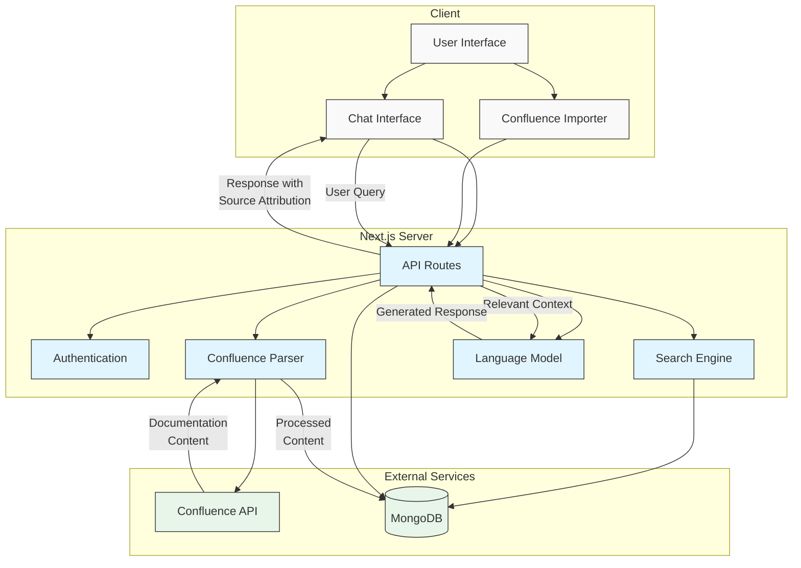

# AVOS Confluence Chatbot System Design

## Architecture Diagram

## Component Description

### Client Components

- **User Interface**: The main web interface built with Next.js, React, and Tailwind CSS
- **Chat Interface**: Interactive chat UI with markdown and code highlighting support
- **Confluence Importer**: Interface for importing Confluence pages via URL

### Server Components

- **API Routes**: Next.js API endpoints for handling requests
- **Authentication**: User session management
- **Confluence Parser**: Parses HTML content from Confluence pages using Cheerio
- **Search Engine**: Searches MongoDB for relevant documentation based on user queries
- **Language Model**: Processes user queries and generates responses

### External Services

- **Confluence API**: Source of documentation content
- **MongoDB**: Database for storing processed documentation content

## Data Flow

1. Users import Confluence pages via the importer interface
2. The system fetches content from Confluence API
3. The parser processes HTML content and stores it in MongoDB
4. Users ask questions in the chat interface
5. The system searches MongoDB for relevant documentation
6. The language model generates responses based on the retrieved content
7. Responses are displayed to the user with source attribution

## Technology Stack

- **Frontend**: Next.js 14, React, Tailwind CSS
- **Backend**: Next.js API Routes
- **Database**: MongoDB with Mongoose ODM
- **Parsing**: Cheerio for HTML parsing
- **Markdown**: React-Markdown for rendering markdown and code blocks
- **Styling**: TailwindCSS for responsive design 